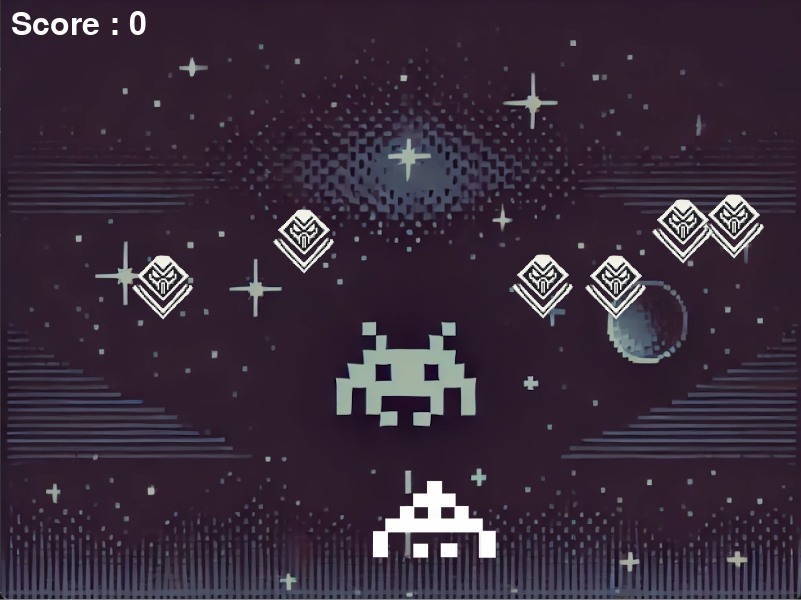

# Space Invalides 
Welcome to **Space Invalides**! This is a fun and challenging game built with Python and Pygame. My first Python game is similar to Space Invaders 😄 Dont know how old. I made an update, now it works in 2024 😄
### Note: in docs-folder the static version -but slower!
## How to Play

- **Move**: Use the **arrow keys** to navigate your spaceship.
- **Shoot**: Press the **spacebar** to shoot at the incoming enemies.

But be warned, this game isn't as easy as it seems!

## Installation

1. **Install Pygame**: Before you can play, make sure you have Pygame installed. You can install it using pip:

    ```bash
    pip install pygame
    ```

2. **Run the Game**: After installing Pygame, simply run the Python script to start the game:

    ```bash
    python game.py
    ```

## Assets

The game features retro-style graphics, which are located in the `img` folder.

---

Get ready for a retro gaming experience that’s more challenging than it looks!

## Screenshot


