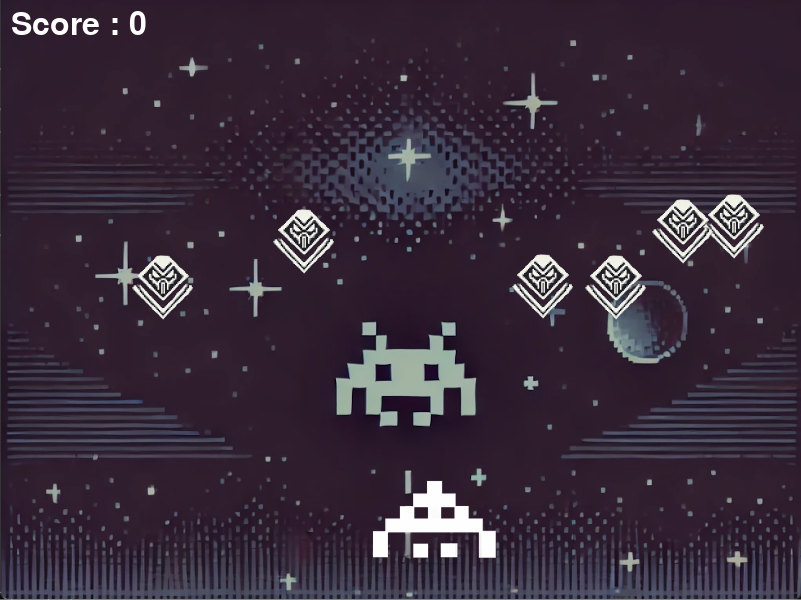

# Space Invalides
##### learning game metrics

Welcome to **Space Invalides**!
A fun and challenging retro shooter game inspired by Space Invaders — available in two flavors:

* **Python version** built with Pygame (my first Python game, updated to work in 2024/25 😄)
* **Web version** pure HTML/CSS/JavaScript, runs in your browser (hello GitHub Pages!) [Demo](https://volkansah.github.io/Space-Invalides/)


## How to Play

* **Move**: Use the **arrow keys** (left/right) to navigate your spaceship (Morty style!).
* **Shoot**: Press the **spacebar** to blast incoming enemies.

Beware: It looks simple, but it’s tougher than it seems!


## Versions & Installation

### Python (Pygame) Version

1. Install Pygame:

```bash
pip install pygame
```

2. Run the game:

```bash
python game.py
```

### Web Version (HTML/JS)

Open `index.html` in any modern browser and jump straight into the action — no installs needed!

---

## Assets

Retro pixel art graphics live in the `img` folder. Replace to customize your Rick & Morty vibes!

---

## Screenshot



---

Get ready for some pixelated chaos — may the best Morty win!
